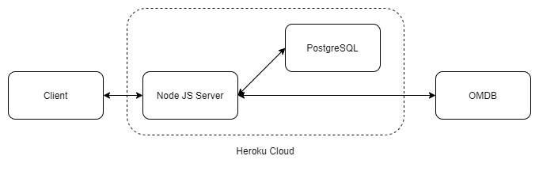

# MovieSearch

This repository houses the code for the MovieSearch Website hosted [here](https://still-meadow-69431.herokuapp.com/). This website can be used to simply search the IMDB database with the search history being saved only when there is a user logged in. 

The server runs on Node.js using EJS as the templating engine and Bootstrap 5.0 on the front end. The system diagram is represented below for reference. 



It should be noted here that the design decision to make the server call the OMDB API was influenced by both security concerns of having the API key embedded in the front-end and giving the client a single access point to query all its data from. 

As part of this website the following concepts have been demonstrated throughout the code:

1. Bootstrap and its grid system 
2. How to create REST APIs using Node.js
3. How to consume other web APIs for data
4. Templating web server using EJS
5. Session Management
6. Limiting number of API calls by fetching data only when required

To run the code first install all the required packges using
```
npm install
```
Then start the server which will be hosted on ```locahost:5000``` using. You can also host it on Heroku. 

```
npm start
```
This codebase should not be taken as a yardstick for security as handling sensitive data using environment files hasn't been tackled. Furthermore, the client side code hasn't been packaged to reduce the size and obfuscate the code. The below known bugs section identifies the bugs that currently exist in the site which will be patched over successive iterations. The heroku version of this code simply replaces the database component of the server under the ```prod``` branch which has not been uploaded to this repository intentionally.

### Code Structure
1. ```scripts``` - Houses the client side javascript code for various event listeners.
2. ```views``` - Houses the 3 main pages i.e. ```index```, ```results``` and the ```history``` pages in EJS template format.
3. ```views/partials``` - House the common header and navbar content common across all pages
4. ```index.js``` - Server side code which contains all the APIs required by the client.

### Known Bugs and Future Enhancements
1. None of the client side web APIs handle erroneous output
2. Input sanitization needs to be added 
3. Switching between Log In and Sign Up tabs of the dropdown closes it
4. The SignUp button doesn't inform the user that he/she can login once the information has been pushed to the database.